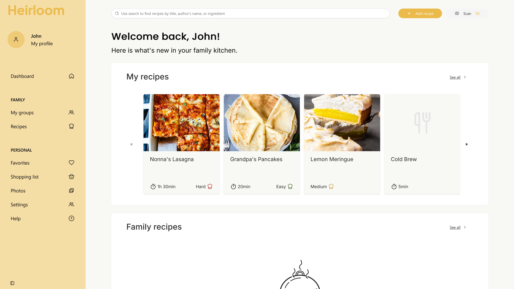
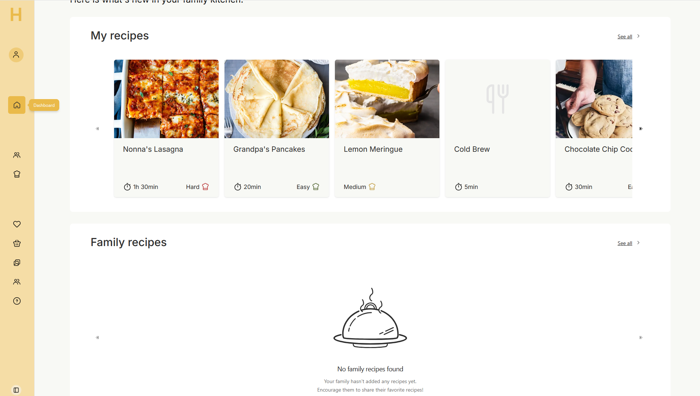
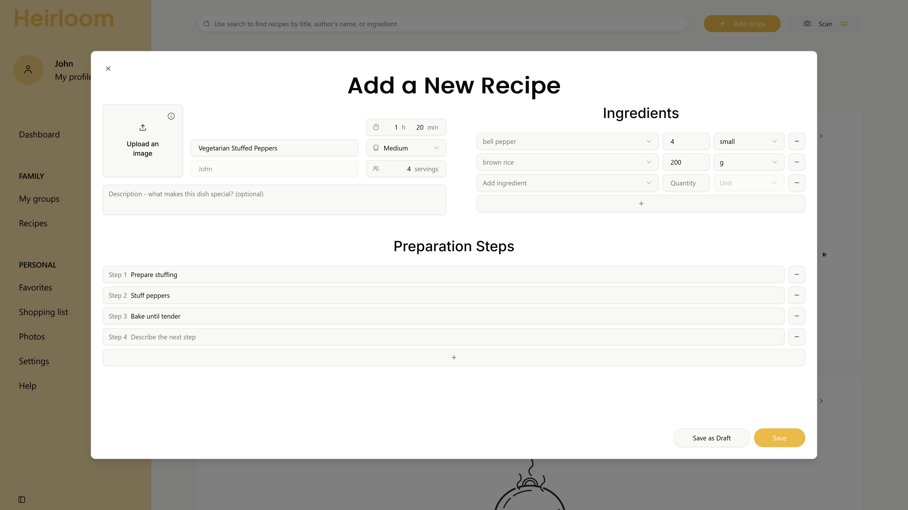
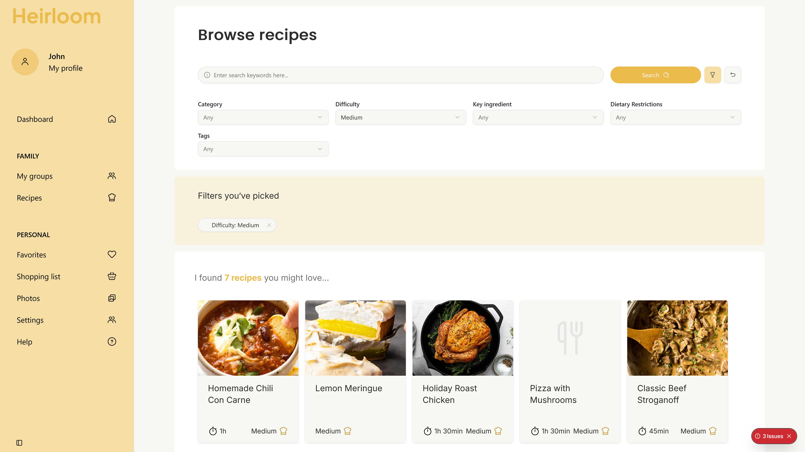
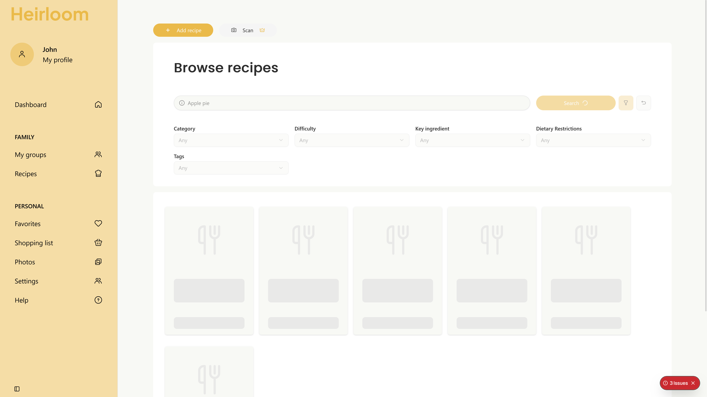

# Heirloom — Private Family Recipe Book (Showcase)
 

A thoughtfully designed web app for preserving family recipes, memories, and variations in a private, invite‑only space.
  **Note**: This is a *showcase repository* with screenshots, architecture notes, and a public demo (coming soon). The full source code is private. 
Recruiters/hiring managers can request access. See **[code access](#contact-and-code-access)** below.

 

## ✨ What is Heirloom?

Heirloom is a private, family‑only digital recipe book. It helps families collect original recipes, preserve stories around each dish, and create respectful variations, all wrapped in an accessible, modern UI.

### Core Features

* **Private Family Groups** - invite‑only spaces; recipes stay within the family.
* **Add Recipes** - type manually or upload photos; (planned premium) **scan handwritten cards**.
* **Linked Variations** - keep the original intact while allowing modern twists.
* **Cooking Mode** - focused, step‑by‑step view in the kitchen.
* **Shopping List** - send ingredients straight to a private list.
* **Collaborative Story Section** - memories, origins, and anecdotes per recipe.
* **Smart Organization** - categories, tags, and ingredient search.
* **Secure & Private by Default** - visibility controls and safe storage.
* **Accessible Design** - large text options, contrast, and simple navigation.
 

>This app is an **actively developed web application** built with scalability and real-world usability in mind. While the core features are already functional, many features and code base are still being enhanced before the public release. Heirloom is being developed with a “product‑first” mindset: fewer, well‑polished features that offer great user experience.

 

## Tech Stack

* **Framework**: Next.js (App Router) + TypeScript
* **UI**: TailwindCSS + shadcn/ui
* **ORM & DB**: Prisma + PostgreSQL
* **Auth**: NextAuth, social login (planned), email verification
* **Storage**: blob storage for images (planned)
* **Infra**: Vercel (planned)

 

## Architecture Overview

* **App Router** splits routes into public (marketing/landing) and app (authenticated) areas.
* **Feature Modules** for recipes, variations, stories, shopping list.
* **Server Actions** for mutations where suitable; API routes where explicit boundaries are needed.
* **Prisma Schema** models families, users, recipes, steps, ingredients, stories, and variations.
* **Access Control** enforced at the data access layer and guarded server‑side.
  
 

## UI Highlights
| Screenshot | Description |
|-------------|--------------|
|  | **User Dashboard** - overview of recent recipes, family activity, and personalized shortcuts. |
|  | **Dashboard (with collapsed sidebar)** - a compact navigation layout for focused browsing. |
|  | **Add Recipe Dialog** - add new recipes manually or via photo upload; supports category and ingredient tagging. |
|  | **Search (with applied filters)** - find recipes by ingredients, tags, or categories. |
|  | **Search (in loading state)** - smooth skeleton animation while results are loading. |

 

## 🔐 Security & Privacy

Heirloom is designed private‑first: invite‑only family spaces, explicit visibility on each recipe/story, and secure storage. Public sharing (if enabled) is opt‑in and scoped.

 

## About the Creator

I’m a frontend‑leaning full‑stack engineer focused on UX, component systems, and robust, maintainable code. 

The concept and design of **Heirloom** were developed entirely by me — from idea to execution.  
I began by designing the initial **mockups and flows in Figma**, focusing on clarity, warmth, and accessibility.  
Since then, I’ve continuously **iterated on both the UI and UX** as development progressed, refining the structure and visuals to better fit real-world use cases.

This project also represents my **learning journey with Next.js**, as I transition from a **.NET/React background** toward a more modern, full-stack JavaScript workflow.  
I use Heirloom not just to build a product, but to **deepen my expertise in React Server Components, API routing, authentication flows, and scalable frontend architecture**.

 

## 📄 License

© Aneta Barloga. All rights reserved. This repository is a **showcase**; distribution of the private source code is not permitted. Screenshots and documentation may be used for evaluation in the context of hiring.

 

## Contact and Code Access

The source code is kept private to protect the product’s long‑term potential. **If you’re a recruiter or hiring manager**, I’m happy to grant read‑only access:

* Email me at **anetabarloga@gmail.com**
* Or message me on [LinkedIn](https://www.linkedin.com/in/anetabarloga "Go to my LinkedIn")
